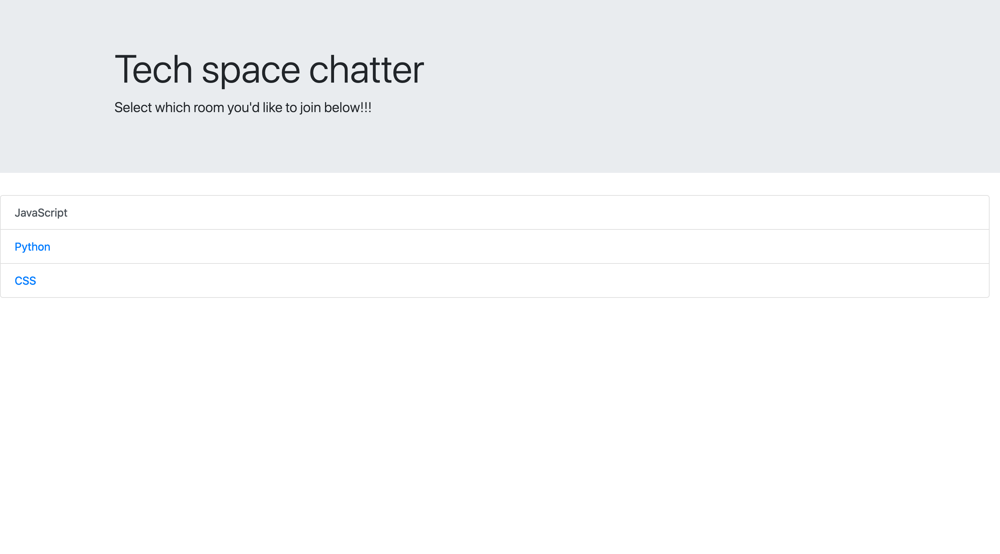
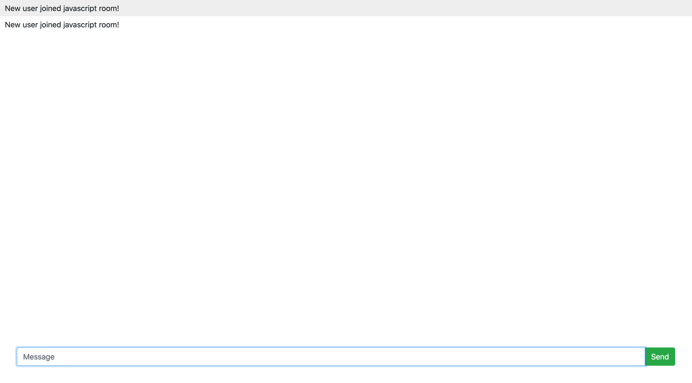
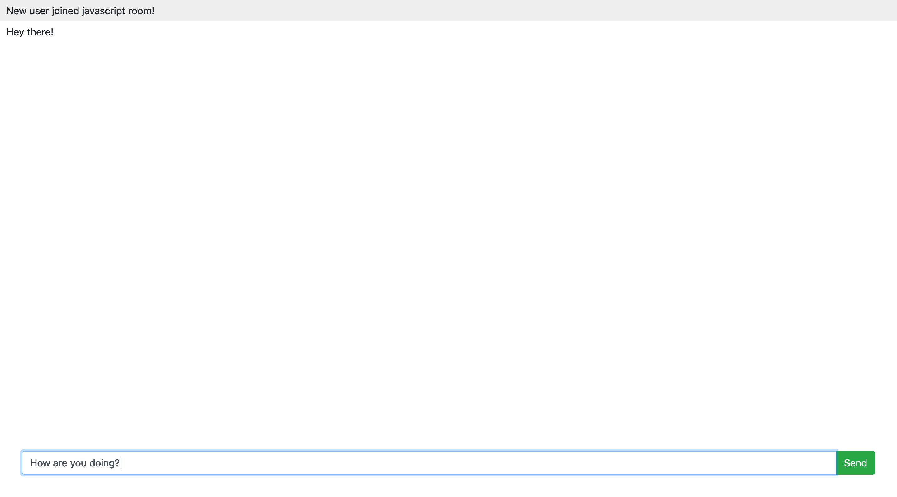

# README app
[](https://shields.io/)

## Description

A very simple chat application using Node.js, Express.js, and Socket.io. The chat application
has three rooms for tech related topics which allows for separate discussions within the same
server.

## Installation

To install the necessary dependencies, run the following command:

```
npm i
```

## Usage
To run the program
```
npm run start
```


## License

This project is licensed under the MIT.

## Tests

```
npm test
```

## Images


